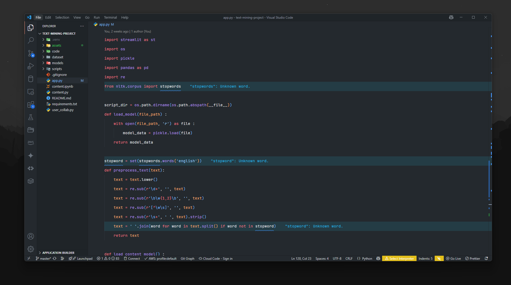

# VS Code Minimalist Settings

## ⚙️ Configuration Overview
- Editor Zoom Level: Not explicitly set (defaults apply).
- Color Theme: Set to GitHub Dark for a modern, dark interface.
- Icon Theme: Uses material-icon-theme for consistent and clean icons.
- Product Icon Theme: Set to material-product-icons.

## 📂 Explorer and Sidebar
- Sidebar Location: Left (workbench.sideBar.location: left), default layout.
- Indentation Guides: Disabled (renderIndentGuides: none) for a cleaner file tree.
- Tree Sticky Scroll: Disabled to avoid sticky file headings.
- Tree Expand Mode: Set to singleClick for quicker navigation.
- Tree Indent: Set to 8 for more spacing between levels.

## 🧑‍💻 Editor Settings
- Line Numbers: Hidden for minimal distraction.
- Font Family: JetBrainsMono Nerd Font with fallback to GohuFont uni14 Nerd Font Mono.
- Font Size: 14, optimized for readability.
- Line Height: 2.5, offering generous vertical spacing.
- Letter Spacing: 0.3 for better character clarity.
- Word Wrap: Enabled.
- Line Highlighting: Disabled (renderLineHighlight: none).
- Minimap: Disabled to reduce UI clutter.
- Tabs: Only a single tab shown (showTabs: single) for a simplified layout.
- Editor Tab Height: Compact (density.editorTabHeight: compact).
- Editor Actions Location: Hidden.

## 💡 Font Rendering and Animations
- Font Ligatures: Not explicitly mentioned, assumed based on JetBrainsMono.
- Smooth Caret Animation: Enabled (cursorSmoothCaretAnimation: on).
- Cursor Animation: Enabled (animations.CursorAnimation: true).

## 🧩 Terminal Settings
- Default Profile: Windows PowerShell.
- Tabs: Hidden for simplicity.
- Line Height: Set to 1.6.
  
## 🌐 Miscellaneous
- Breadcrumbs: Disabled for cleaner UI.
- Layout Control: Disabled (layoutControl.enabled: false).
- Command Center: Disabled (window.commandCenter: false).
- CSS Completion: Property value auto-completion disabled.
- Copilot Terminal Chat: Set to appear in terminal.
- JSON Formatting: Uses Prettier (esbenp.prettier-vscode) as the default formatt
